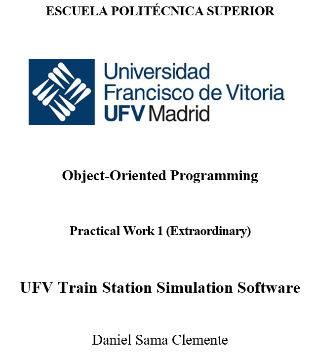
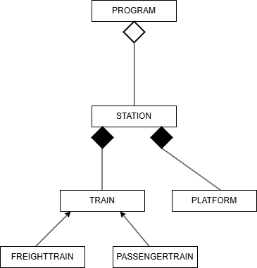

# oop_pw1_ext_2425

This repository is the base element for the development of Practice 1 for the extraordinary OOP exam session. 

## 1. COVER 

    

## 2. TABLE OF CONTENTS 

- [1. COVER](#1-cover)
- [2. TABLE OF CONTENTS](#2-table-of-contents)
- [3. INTRODUCTION](#3-introduction)
 - [3.1 NAMES OF THE GROUP MEMBERS](#31-names-of-the-group-members)
 - [3.2 SUMMARY OF THE DOCUMENT](#32-summary-of-the-document)
- [4. DESCRIPTION](#4-description) 
 - [4.1 PROPOSED SOLUTION](#41-proposed-solution)
 - [4.2 CLASS DIAGRAM](#42-class-diagram)
 - [4.3 DEVELIPMENT CONSIDERATIONS](#43-development-considerations)
- [5. PROBLEMS & CHALLENGES](#5-problems--challenges)
- [6. CONCLUSIONS](#6-conclusions)
 - [6.1 LESSONS LEARNED](#61-lessons-learned)
 - [6.2 EFFECTIVENESS](#62-effectiveness)
 - [6.3 INSIGHTS LEARNED](#63-insights-gained)
- [7. IMPORTANT NOTES](#7-important-notes)
- [8. TIMELINE OF DEVELOPMENT](#8-timeline-of-development)

## 3. INTRODUCTION 

### 3.1 NAMES OF THE GROUP MEMBERS

    Daniel Sama Clemente

### 3.2 SUMMARY OF THE DOCUMENT

This document shows all of the inform regarding on how OOP principles have been used to, create a program resembling a Train Station Simulation of trains arriving and docking. This program was built for the Practical Work 1 (Extraordinary) of the OOP (Object-Oriented Programming) subject. As stated before, the program simulates the management of arriving trains into a train station and docking them. 

## 4. DESCRIPTION

### 4.1 PROPOSED SOLUTION 

The program has been developed into 6 classes (including the Program class), in which each class does something specific. The classes in the program are as they follow: 

**PROGRAM**: This is the entry point of the program, in where the user is given the welcome message and where the user is also asked about how many platforms he wishes the platform to have. After this the station is instantiated with the specific amount of platforms the user has asked. Then the program is taken to the to a method in the Station class which displays a menu for the user. 

**STATION**: This is probably the most importnt class in the whole program, as it creates the list of Trains and Platforms. Tells the user which options to select, controls the inputs, loads the trains' data from a specific file; adds those trains list making sure data has been entered appropiately, making sure no ID is reapeted and also checking that at least the data of 15 trains is found, otherwise the trains are not loaded to the program. Futhermore, during each tick in the simulation, each train's arrival time is reduced by 15 minutes, shows the status of the trains and the platforms, and when a train is waiting it sends a request to the Platform class to start the docking of a train. The attributes used in this class are as follows: 

Train: List<Platform> platforms -> Creates the list of platforms (number of them is given by the user).
Platform: List<Train> trains -> Creates the list of the trains (loaded from a specific file given by the user).

Composition was used for both lists, in the context of platforms, a platform can't exist if there is no station, the same can be argued vice-versa. It can also be argued that the station has no point in existing if there are no trains which use it. 

Other attributes include: 

int minutesPerTick = 15 -> Makes sure that each of the ticks represents 15 minutes. 
        
bool allTrainsDocked = false -> Controls when all trains have been docked to automatically stop the simulation.

**PLATFORM**: Ths class managed everything related to the platform, like assigning a train to a platform when the platform is free, calculating the ticks the train needs to fully dock, and well as changing the proper state of the platform when its freed or occupied. This class essentially takes and checks the request, from the Station class, to assign a train to a platform, if it is possible and communicates it back to the Station class. The attributes in this class are as follows: 

string id -> Defines the id of each platform.

enum PlatformStatus platformStatus -> Defines the state of the platform in each tick.

Train currentTrain -> Property, which assigns a train to a specific platform.

int dockingTime -> The amount of ticks neccesary for the docking process to finish.

**TRAIN**: This is an abstract class, it used the principle of abstraction as each of the trains loaded will have to be one of the subclasses (Freight or Passenger), in other words each train will only belong to a specific subclass, thus no general Train is created. This class also uses the principle of inheritance as it is the superclass of each train created. Furthermore this class uses polymorphism principles as there is a virtual method which prints the generic characteristics of each train and then overrides methods in the subclasses, it prints the base method and then the override method. The attributes in this class are as follows: 

string id -> Defines the train number 

TrainStatus trainStatus -> Defines the state of the train (EnRoute, Waiting, Docking, Docked).

int arrivalTime -> The arrival time, in other words, the time remaining until the train reached the station.

string type -> Shows the type of train (Passenger or Freight).

**FREIGHTTRAIN**: This is a subclass which inherits from the superclass of Train. It has the override method which prints the 2 extra attributes which only exist with Freight Trains. The attributes from the Superclass are passed down, the unique attributes for this class are as they follow: 

int maxWeight -> The maximum weight a specific freight train can carry. 

string freightType -> The type of goods a specific freight train is carrying.

**PASSENGERTRAIN**: This is a subclass which inherits from the superclass of Train. It has the override method which prints the 2 extra attributes which only exist with Passenger Trains. The attributes from the Superclass are passed down, the unique attributes for this class are as they follow: 

int numberOfCarriages -> The number of carriages a certain passenger train has. 

int capacity -> The amount of capacity a certain passenger train has. 

### 4.2 CLASS DIAGRAM 

    

### 4.3 DEVELOPMENT CONSIDERATIONS

- The different consideration must be followed to develop the program: 

- The user input to the program how many platforms there may be in the station.

- The program must implement comprehensive input validation to handle errors. 

- The user also input to the program (through keyboard) the path to the file where the train data is to be loaded to the program. 

- The file must also have a minimum of 15 trains to be loaded. 

## 5. PROBLEMS & CHALLENGES

The creation of the repo was not a problem, however it was difficult on how to get it right. To start off an example of a base program was already given to us and was obligatory to use, so I did everything I could, including downloading, to put it into my git folder in my computer and try to upload and create a new repository in github, but that didn't work. I looked online for a solution and it was rather simple, I only had to use the "fork" function in GitHub, which sort of "copies" the existing repository from another user into a repository in my GitHub account and creates a new repository. This was simple to solve and it is a very useful function that I don't see why I would not use it in the future. 

Given that I had already had a previous activity of handling a Landing Simulation, the code to do was somewhat similar however instead of using an Array for the platforms, like I used last time I had to do a list this time, so I had to find a way to create a list of platforms, however it was a simple issue to solve as I just did a loop, in which each iteration was a new instance of a new platform which was created. 

Something which I did not do last time was using the encapsulation practises to make sure the attributes of each class had the appropiate security level, the problem came when I did the code and it was mostly working but then I realised that all of my attributes where public and I needed to increment the privacy of each access modifier. Of course that meant changing parts, adding getters and setters in the subclasses and the base class. I thought it was going to be more difficult that I imagined but I referred to the slides of the subject to see how getter and setter methods work and I managed to solve this challenge. 

There is another issue that I found, when all of the trains were docked the program must finish however, the problem is that how I designed the program to work was an endless loop which made the program continue even though all trains were docked, to fix this I implemented a bool which told the method which then class the loop to be set to false, and then when true it would not execute the loop (Advance Tick method) and since no other instruction is added in that method the program would finish. 

Finally, a problem that I thinked of was, even if a file is found and the data format is correct, there is a chance that a file may have a header or not, this was a problem since if a file was loaded and the program was initially designed to skip the header or not, data from trains will not be loaded correctly. To solve this I though of doing 2 StreamReaders, the first one would read the first line, no matching criteria for a header was found a bool was sent as false and the StreamReader would close the file, on the other hand if criteria for a header was found in the first line the same bool was set to true and then the file would be closed. On to the second StreamReader, if the bool was set to true, the first line(header) would be skipped, if bool was false the first line would not be skipped(as it would be train data). 

## 6. CONCLUSIONS

### 6.1 LESSONS LEARNED 

One lesson that I have learned is how powerfull the enums have been to do this project not only because it is a variable, which also makes it easier, but also because when using them in method in which they autodefine themselves when typing and they save a lot of time when programming and also they enhance clearness to both the user and the developer. 

Another thing which I have learned is how efficient also the List tool, it is like creating a database but where multiple object of subclases can be stored there and later with a foreach loop can be reached, all of them without any problems or difficulties. 

Both of them when being developed, as starting the program from scratch may take some time and may be a bit tideous, but from the point of view of developing a program they are very efficient. 

Finally, another thing that I have learned is the power, effectiveness and efficiency of using the encapsulation principles, like being able to make attributes private and only being passed when the program specificaly asks for them using setter and getter methods. 

### 6.2 EFFECTIVENESS 

I can say that this program now complies with the given requierements for the Practical Work 1 (Extraordinary). Where it correctly simulates the arrival of trains using the principles of OOP. 

Even though not mentioned in the Practical Work 1 statement, I have made sure to add more behaviours to avoid potential accidental erros and have a more realistic process. Some of the new behaviours include. 

 - No same trains will have the same ID 
 - When a train has reached the station the arrival time, even though the program after substraction could make it negative, it is set to 0, to avoid understanding errors and keeping the simulation as close as possible to a real scenario. 
 - When a train is in a Waiting state, if no Platforms are available the train will continue to be in a Waiting state. 
 - Also catch exceptions have been done to prevent errors. 

### 6.3 INSIGHTS GAINED

As stated before, the insights I have learned is overall how to use the enums and how powerful and efficient they can be not only for being clear and simple, but also because they are easy to create and when programming how they can reduce time. 

Another thing I could say is that as I was advancing with the planning and the creation of the project we have also realized how and where to implement the principles of OOP (Polymorphism, Abstraction, Encapsulation and Inheritance), I only knew how to implement inheritance and polymorphism, but thanks to this project I have been able to understand how Encapsulation works and how to apply it in a program.  

## 7. IMPORTANT NOTES 

The program was named after this: 

    The zip file must be named following the next naming convention: practical_work_i_oop_[id] (n is the student id).

So the id which was used was the ID which was found in the University Portal. An image below is shown as evidence: 

    

The program should also take into consideration that a custom file with the train data must be loaded. For reference in the files folder of the project 2 example files can be found, one has a header and another does not. 

[SEE EXAMPLE FILES](../files/example_files/)

## 8. TIMELINE OF DEVELOPMENT ##

### 12/06/2025 ###

Forked the repo from the base repo. 

Made the corresponding folder as stated. 

Added the correct files in their corresponding folder. 

### 13/06/2025 ### 

Created the files necessary for each class. 

Added constructors and also their properties necessary.

Added the syntax in the Program and Station class to print the menu. 

Added the selection menu to the Station class.

### 14/06/2025 ###

Added the method to allow the trains to be loaded from a file. 

### 18/06/2025 ###

Added in the constructor a ConsoleWriteLine to show the creation of each Platform by the console to the user. 

Corrected errors in the file loading. 

Added the virtual methods for printing the details of the platforms and trains. 

Added partially the DisplayStatus method to show through the console the trains loaded from the file. ÇÇ

Added a method to make sure no duplicate ID's are loaded from the file. 

### 19/06/2025 ###

Implemented the GetStatus method in the platform, in order to fully print the status of the platform in the DisplayStatus method. 

Changed a variable name for more clarity. 

Added management for docking and futher related tasks to do with platforms in the platform class.

Fully implemented the AdvanceTick method. 

Added clarity for the code reading in the console in the Program class. 

Added a new method to manage the request of platforms, for arriving train and setting them to waiting or allowing them to process the request. 

Removed unnecessary code in the Platform class. 

Added a method to check when all the trains are docked and end the program. 

Fixed minimal errors in the program class. 

Added setters and getters as well as changed the atributes of each class(not applied to Program) to the maximum access modifier possible to enhance encapsulation. (Protected for attributes in Train Class, rest are private). 

Added exceptions to the Station and Platform class. 

Fixed some typos in the Program Class. 

Added comments on all classes. 

Made a change in the LoadTrainFromFile method in the Station class, to automatically load the trains from a file regardless if it has a header or not, without losing data of trains. 

### 20/06/2025 ###

Added the cover image to put on the README file. 

Made some changes into the behaviour of the program. 

Added the class Diagram Image. 

### 21/06/2025 ###

Added an image which shows the ID from the University. 

Added all of the README.md sections for the documentation. 

Added example files which show how the correct file format to load trains into the program. 

### 22/06/2025 ###

Fixed some typos in the README.md file and on comments along various classes. 